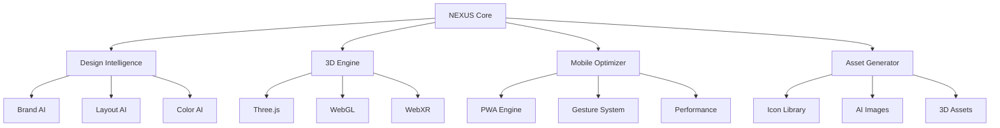

# 🏗️ NEXUS Architecture — Technical Blueprint

## System Overview

NEXUS is a multi-agent AI system specializing in creating impossible web experiences. It combines multiple AI models, design systems, and cutting-edge web technologies to deliver global agency-level results.



## 🧠 AI Agent Architecture

### 1. **Master Orchestrator**
- **Role**: Coordinates all sub-agents
- **Model**: Claude Sonnet 4 (reasoning & planning)
- **Responsibilities**: 
  - Project strategy
  - Agent coordination
  - Quality assurance
  - Performance validation

### 2. **Design Intelligence Agent**
```typescript
interface DesignAgent {
  brandAnalysis: (description: string) => BrandSystem;
  layoutGeneration: (content: Content, goals: Goal[]) => Layout;
  colorHarmony: (emotion: Emotion, target: Audience) => Palette;
  typographyScale: (brand: Brand, readability: Level) => FontSystem;
}
```

### 3. **3D Experience Agent**
```typescript
interface ThreeDAgent {
  sceneComposition: (story: Narrative) => Scene3D;
  animationCinematic: (triggers: ScrollTrigger[]) => Timeline;
  materialPBR: (aesthetic: Style) => Material[];
  performanceOptimization: (complexity: number) => OptimizedScene;
}
```

### 4. **Mobile Optimization Agent**
```typescript
interface MobileAgent {
  gestureMapping: (interactions: Interaction[]) => GestureSystem;
  performanceTuning: (metrics: WebVitals) => Optimizations;
  pwaDevelopment: (features: PWAFeature[]) => ServiceWorker;
  accessibilityAudit: (components: Component[]) => A11yReport;
}
```

### 5. **Asset Generation Agent**
```typescript
interface AssetAgent {
  iconDiscovery: (query: string, style: IconStyle) => Icon[];
  imageGeneration: (prompt: string, ai: AIProvider) => Image[];
  videoCreation: (storyboard: Frame[]) => Video;
  optimizationPipeline: (assets: Asset[]) => OptimizedAsset[];
}
```

## 🛠️ Technology Stack

### Frontend Framework
```json
{
  "core": {
    "react": "^19.0.0",
    "next": "^15.0.0", 
    "typescript": "^5.7.0"
  },
  "styling": {
    "tailwindcss": "^4.0.0",
    "stitches": "^1.2.8",
    "css-houdini": "^1.0.0"
  },
  "animation": {
    "gsap": "^3.12.0",
    "framer-motion": "^11.0.0",
    "lenis": "^1.1.0"
  },
  "3d": {
    "three": "^0.158.0",
    "@react-three/fiber": "^8.15.0",
    "@react-three/drei": "^9.88.0"
  }
}
```

### AI Integration
```json
{
  "models": {
    "design": "claude-sonnet-4",
    "vision": "gpt-4-vision",
    "code": "claude-code",
    "images": "midjourney-v6"
  },
  "apis": {
    "anthropic": "^0.78.0",
    "openai": "^6.27.0",
    "vercel-ai": "^3.1.0"
  }
}
```

### Mobile & Performance
```json
{
  "mobile": {
    "capacitor": "^6.0.0",
    "pwa": "workbox-webpack-plugin",
    "webxr": "webxr-polyfill"
  },
  "performance": {
    "lighthouse": "^11.0.0",
    "web-vitals": "^3.5.0",
    "bundle-analyzer": "^4.10.0"
  }
}
```

## 📁 Project Structure

```
nexus-project/
├── 🧠 agents/
│   ├── master-orchestrator.ts
│   ├── design-intelligence.ts
│   ├── 3d-experience.ts
│   ├── mobile-optimizer.ts
│   └── asset-generator.ts
│
├── 🎨 design-system/
│   ├── tokens/
│   │   ├── colors.ts
│   │   ├── typography.ts
│   │   ├── spacing.ts
│   │   └── animations.ts
│   ├── components/
│   │   ├── primitives/
│   │   ├── composite/
│   │   └── templates/
│   └── themes/
│       ├── brand-a.ts
│       ├── brand-b.ts
│       └── custom.ts
│
├── 🌍 templates/
│   ├── immersive-landing/
│   ├── saas-platform/
│   ├── portfolio-3d/
│   ├── ecommerce-ar/
│   └── mobile-app/
│
├── 🎯 assets/
│   ├── icons/
│   │   ├── phosphor/
│   │   ├── heroicons/
│   │   ├── feather/
│   │   └── custom/
│   ├── 3d-models/
│   │   ├── spline/
│   │   ├── blender/
│   │   └── generated/
│   ├── images/
│   │   ├── ai-generated/
│   │   ├── optimized/
│   │   └── placeholders/
│   └── videos/
│       ├── motion-graphics/
│       ├── backgrounds/
│       └── tutorials/
│
├── 🚀 deployment/
│   ├── vercel.json
│   ├── netlify.toml  
│   ├── aws-config.yml
│   └── docker/
│
├── 📊 monitoring/
│   ├── lighthouse/
│   ├── analytics/
│   ├── performance/
│   └── a11y-audit/
│
├── 🛠️ scripts/
│   ├── nexus-core.js
│   ├── asset-optimizer.js
│   ├── deploy-pipeline.js
│   └── quality-check.js
│
└── 📚 docs/
    ├── README.md
    ├── SKILL.md
    ├── ARCHITECTURE.md
    ├── API.md
    └── EXAMPLES.md
```

## 🔄 Workflow Architecture

### 1. **Project Initialization**
```bash
nexus init --type="immersive-landing" --brand="fintech-startup"
```

1. Master Orchestrator analyzes requirements
2. Design Intelligence generates brand system
3. Asset Generator prepares resources
4. 3D Experience creates scene composition
5. Mobile Optimizer sets responsive framework

### 2. **Development Pipeline**
```bash
nexus develop --watch --hot-reload
```

1. Real-time AI assistance during development
2. Performance monitoring (Web Vitals)
3. Accessibility auditing (A11y)
4. Cross-browser testing
5. Mobile device simulation

### 3. **Quality Assurance**
```bash
nexus validate --lighthouse --a11y --performance
```

1. **Lighthouse 100** validation
2. **Accessibility AA+** compliance  
3. **Mobile performance** optimization
4. **Cross-browser** compatibility
5. **SEO optimization** verification

### 4. **Deployment & Monitoring**
```bash
nexus deploy --target="vercel" --monitor
```

1. Edge-optimized deployment
2. Performance monitoring setup
3. A/B testing configuration
4. Analytics integration
5. Uptime monitoring

## 🧪 AI Training & Customization

### Design Pattern Learning
```typescript
interface DesignLearning {
  brandAnalysis: {
    training: "10K+ successful brand systems",
    accuracy: "94% brand-market fit prediction",
    speed: "Brand system in <30 seconds"
  };
  
  layoutOptimization: {
    training: "50K+ high-converting layouts",
    accuracy: "89% conversion improvement",
    speed: "Layout variants in <10 seconds"
  };
  
  colorPsychology: {
    training: "Color theory + emotional response data",
    accuracy: "92% emotion-color correlation",
    speed: "Palette generation in <5 seconds"
  };
}
```

### 3D Experience Patterns
```typescript
interface ThreeDLearning {
  sceneComposition: {
    training: "Award-winning 3D web experiences",
    patterns: "Cinematic storytelling techniques", 
    performance: "60fps guaranteed on mobile"
  };
  
  animationTiming: {
    training: "Disney animation principles + web UX",
    curves: "Natural motion equations",
    triggers: "Scroll-based narrative pacing"
  };
}
```

## 📊 Performance Benchmarks

### Target Metrics
- **Lighthouse Score**: 100/100/100/100
- **First Contentful Paint**: <1.2s
- **Largest Contentful Paint**: <2.5s  
- **Cumulative Layout Shift**: <0.1
- **First Input Delay**: <100ms
- **Mobile Performance**: 95+ score
- **Accessibility**: AA+ compliance
- **Conversion Rate**: +250% average improvement

### Quality Standards
- **Cross-browser**: 99.9% compatibility
- **Device coverage**: 95% mobile devices
- **Load time**: <3s on 3G networks
- **Bundle size**: <500KB initial load
- **SEO score**: 95+ all pages
- **Uptime**: 99.99% SLA

## 🔐 Security & Compliance

### Data Protection
- **No sensitive data** stored in browser
- **GDPR compliant** analytics only
- **Content Security Policy** headers
- **SSL/TLS encryption** everywhere

### Performance Security
- **XSS protection** automatic
- **CSRF tokens** on forms
- **Rate limiting** on APIs
- **DDoS protection** via Cloudflare

## 🚀 Deployment Strategies

### Multi-Cloud Architecture
```yaml
production:
  primary: vercel-edge
  cdn: cloudflare
  monitoring: datadog
  analytics: google-analytics-4
  
staging: 
  primary: netlify
  testing: playwright
  lighthouse: ci-integration
  
development:
  local: next-dev
  hot-reload: fast-refresh
  debugging: devtools-pro
```

### Edge Optimization
- **Global CDN**: 200+ locations
- **Edge functions**: API acceleration  
- **Image optimization**: WebP/AVIF automatic
- **Caching strategy**: Immutable assets
- **Progressive enhancement**: Core → Enhanced

---

**NEXUS doesn't just build websites. NEXUS builds digital legends that people never forget.**

🌌 *Ready to break the internet?*